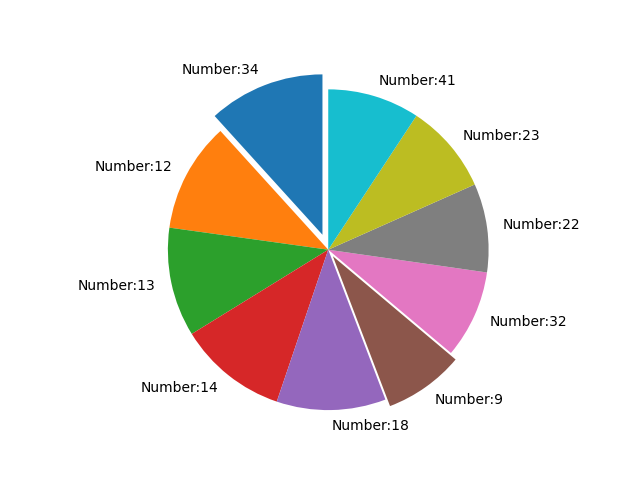
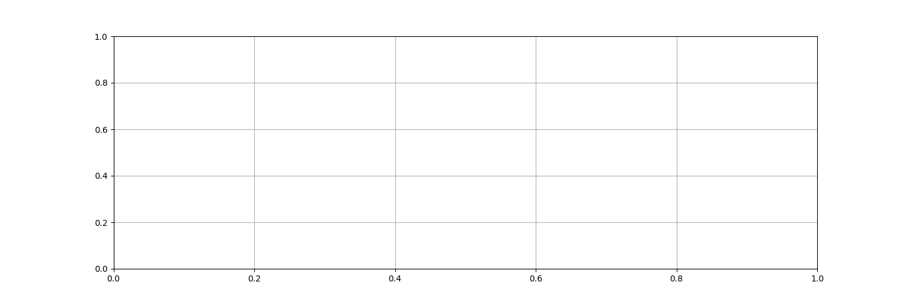
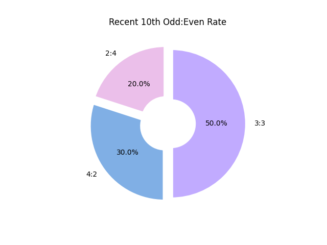
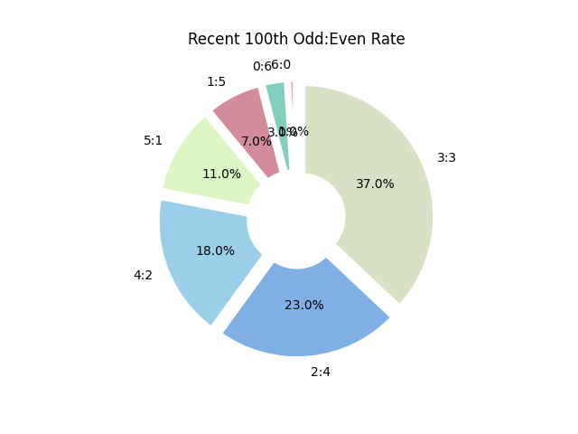
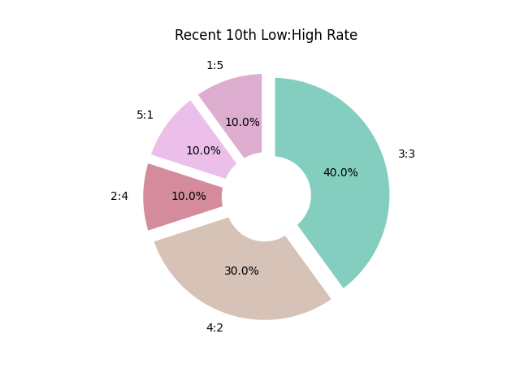
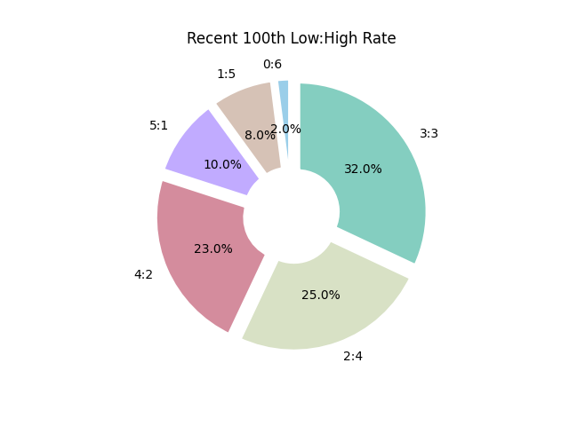

# Lotto Bus 통계
## 연속 출현 중인 번호
 - **42**번이 2회 연속 출현
---
## 연속 미출현 번호
|번호|현재 미출현 회수|최대 미출현 이력|
|:---:|:---:|:---:|
||**32회**|60회|
||**19회**|48회|
||**18회**|36회|
||**16회**|43회|
||**14회**|44회|
---
## 당첨번호 출현 순위
  
|번호|출현 많은 순|번호|출현 적은 순|
|:---:|:---:|:---:|:---:|
||152회||106회|
||147회||114회|
||145회||114회|
||145회||120회|
||144회||121회|
---
## 최근 30회차 당첨번호 패턴

---
|회차|번호1|번호2|번호3|번호4|번호5|번호6|
|:---:|:---:|:---:|:---:|:---:|:---:|:---:|
|1001회|||||||
|1000회|||||||
|999회|||||||
|998회|||||||
|997회|||||||
|996회|||||||
|995회|||||||
|994회|||||||
|993회|||||||
|992회|||||||
|991회|||||||
|990회|||||||
|989회|||||||
|988회|||||||
|987회|||||||
|986회|||||||
|985회|||||||
|984회|||||||
|983회|||||||
|982회|||||||
|981회|||||||
|980회|||||||
|979회|||||||
|978회|||||||
|977회|||||||
|976회|||||||
|975회|||||||
|974회|||||||
|973회|||||||
|972회|||||||
---
## 최근 10회차 홀:짝 비율

---
## 최근 100회차 홀:짝 비율

---
## 최근 10회차 저:고 비율

---
## 최근 100회차 저:고 비율

---