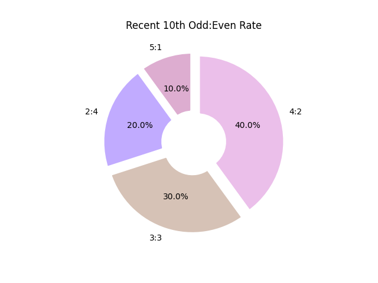
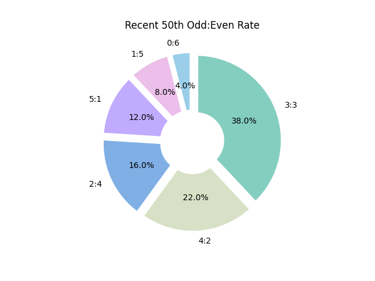
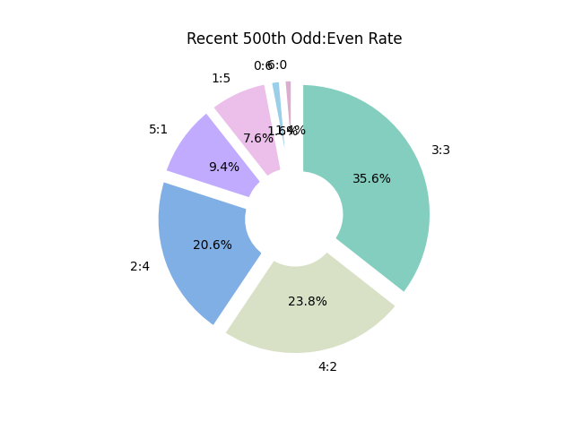
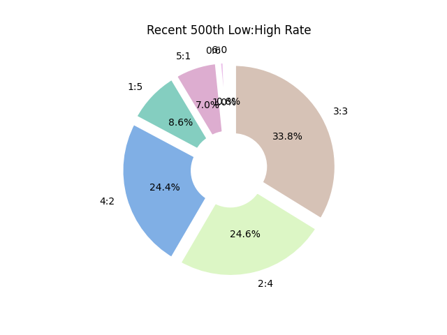

# Lotto Bus 통계
## 최근 10회차 홀:짝 비율

---
## 최근 50회차 홀:짝 비율

---
## 최근 100회차 홀:짝 비율

---
## 최근 500회차 홀:짝 비율

---
## 최근 10회차 저:고 비율

---
## 최근 50회차 저:고 비율

---
## 최근 100회차 저:고 비율

---
## 최근 500회차 저:고 비율

---
## 최다/최소 출현 순위

---

---
## 최근 30회차 당첨번호 패턴

---
|회차|번호1|번호2|번호3|번호4|번호5|번호6|
|:---:|:---:|:---:|:---:|:---:|:---:|:---:|
|973|22|26|31|37|41|42|
|974|1|2|11|16|39|44|
|975|7|8|9|17|22|24|
|976|4|12|14|25|35|37|
|977|2|9|10|14|22|44|
|978|1|7|15|32|34|42|
|979|7|11|16|21|27|33|
|980|3|13|16|23|24|35|
|981|27|36|37|41|43|45|
|982|5|7|13|20|21|44|
|983|13|23|26|31|35|43|
|984|3|10|23|35|36|37|
|985|17|21|23|30|34|44|
|986|7|10|16|28|41|42|
|987|2|4|15|23|29|38|
|988|2|13|20|30|31|41|
|989|17|18|21|27|29|33|
|990|2|4|25|26|36|37|
|991|13|18|25|31|33|44|
|992|12|20|26|33|44|45|
|993|6|14|16|18|24|42|
|994|1|3|8|24|27|35|
|995|1|4|13|29|38|39|
|996|6|11|15|24|32|39|
|997|4|7|14|16|24|44|
|998|13|17|18|20|42|45|
|999|1|3|9|14|18|28|
|1000|2|8|19|22|32|42|
|1001|6|10|12|14|20|42|
|1002|17|25|33|35|38|45|
---